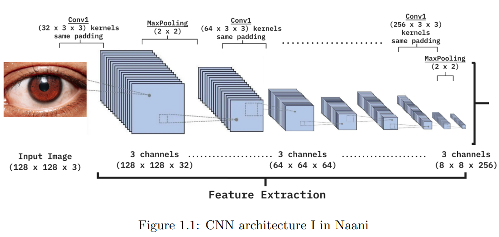
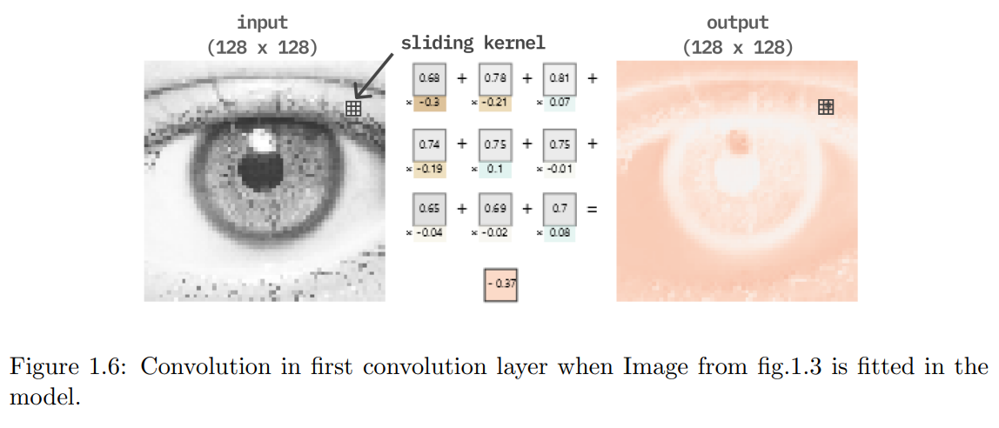

## Info
Naani (meaning "eye" in Nepali) was born out of an idea to help people in remote areas of Nepal quickly check for cataracts using a simple photo. 
With increasing mobile phone access, it offers a more practical solution than traveling to city areas for a checkup. 
Genuinely, An honest effort from our side.

## Model Architecture

You can refer to the [naani.pdf](./naani.pdf) & [trainCnnModel.ipynb](./trainCnnModel.ipynb) for more detailed information about our model's architecture, training process and usage.

